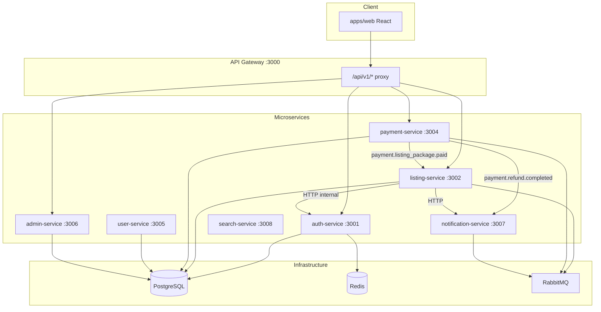
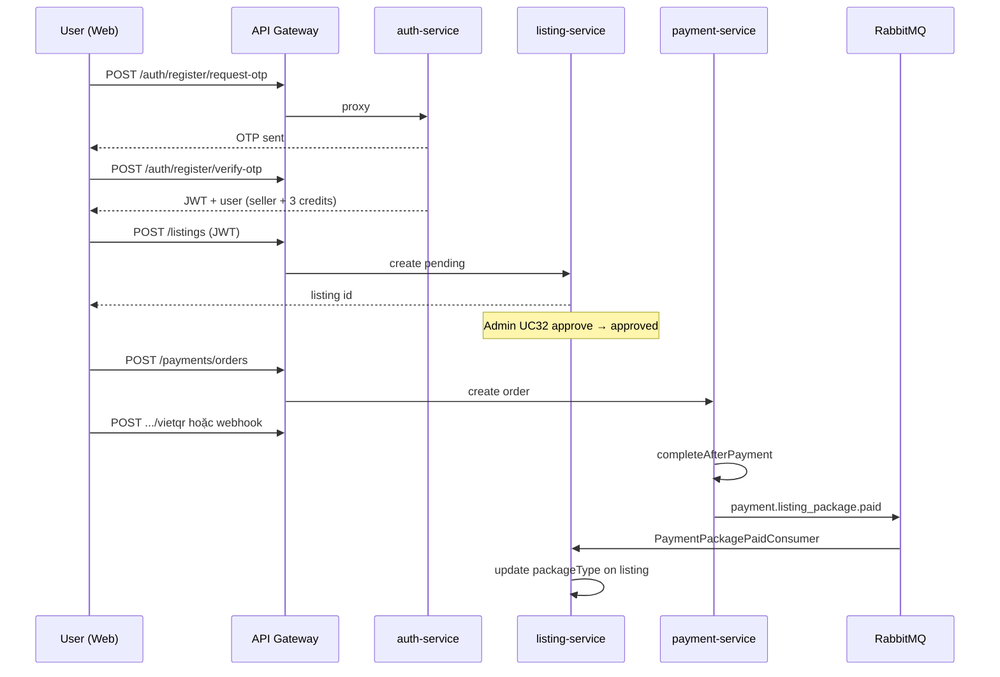

# Car Marketplace — Tài liệu logic dự án

> **Mục đích:** Ghi lại kiến trúc, luồng nghiệp vụ và logic code của monorepo `e_commerce` (Car Marketplace).  
> **Cập nhật:** 2026-05-20 — phân tích từ codebase + GitNexus (2716 symbols, 28 execution flows).  
> **Lưu ý:** Tôi không “ghi nhớ” vĩnh viễn giữa các phiên chat; file này là nguồn tham chiếu chính thức.

---

## 1. Tổng quan

**Car Marketplace** là sàn giao dịch ô tô cũ, triển khai theo **microservices** trên **NestJS + CQRS**, monorepo npm workspaces.

| Thành phần | Công nghệ |
|-----------|-----------|
| Backend | NestJS 11, TypeORM, PostgreSQL |
| Giao tiếp async | RabbitMQ (amqplib) |
| Cache / OTP (auth) | Redis (ioredis) |
| API đầu vào | API Gateway (http-proxy-middleware) |
| Frontend chính | React + Vite (`apps/web`) |
| Frontend legacy | `frontend/` (có thể tồn tại song song) |

**Cổng mặc định (Docker stack):**

| Service | Port |
|---------|------|
| Web (Nginx) | 8080 |
| API Gateway | 3000 |
| auth-service | 3001 |
| listing-service | 3002 |
| payment-service | 3004 |
| user-service | 3005 |
| admin-service | 3006 |
| notification-service | 3007 |
| search-service | 3008 |
| PostgreSQL | 5432 |
| Redis | 6379 |
| RabbitMQ | 5672 / UI 15672 |

Chạy stack: `npm run docker:stack:up` (xem `docker-compose.stack.yml`, `docs/DOCKER.md`).

---

## 2. Kiến trúc tổng thể



**Nguyên tắc:**

- Client **chỉ** gọi Gateway: `/api/v1/...`
- Gateway **reverse-proxy** tới từng service (không chứa business logic).
- **listing-service** là service domain nặng nhất (CQRS, moderation, favorites, reports).
- **auth-service** quản lý user, JWT, OTP, profile seller.
- **payment-service** xử lý đơn thanh toán gói tin, webhook, hoàn tiền.
- **notification-service** subscribe RabbitMQ, gửi thông báo (mock/log).
- **user-service**: xác minh danh tính (identity verification), API nội bộ.
- **admin-service**: dashboard doanh thu, duyệt CCCD (proxy DB), quản lý user.
- **search-service**: hiện chỉ scaffold (Hello World).

---

## 3. Cấu trúc monorepo

```
e_commerce/
├── apps/
│   ├── api-gateway/      # Proxy HTTP
│   ├── auth-service/     # Auth, OTP, profile, bootstrap superadmin
│   ├── listing-service/  # Tin đăng, moderation, favorites, reports
│   ├── payment-service/  # Thanh toán gói tin, webhook, refund
│   ├── user-service/     # Identity verification
│   ├── admin-service/    # Admin dashboard, user management
│   ├── notification-service/
│   ├── search-service/   # Placeholder
│   └── web/              # React SPA
├── libs/
│   ├── common/           # JWT guard, SellerGuard, DTO, exceptions
│   ├── database/         # TypeORM entities, DatabaseModule
│   └── messaging/        # Event names + payment payloads
├── scripts/              # SQL schema patches
├── docs/                 # Tài liệu (file này)
└── docker-compose.stack.yml
```

**Shared packages:**

- `@car-marketplace/common` — `JwtAuthGuard`, `SellerGuard`, `JwtRequestUser`, pagination, domain exception.
- `@car-marketplace/database` — `UserOrmEntity`, `DatabaseModule`, TypeORM config.
- `@car-marketplace/messaging` — `LISTING_EVENTS`, `PAYMENT_EVENTS`, payload types.

---

## 4. API Gateway — định tuyến

File: `apps/api-gateway/src/app.module.ts`

Global prefix: `/api`, versioning URI: `/v1`.

| Path Gateway | Target service | Ghi chú |
|--------------|----------------|---------|
| `/api/v1/listings`, `/api/v1/listings/*` | listing-service :3002 | Body fix qua `fixRequestBody` |
| `/api/uploads/listings/*` | listing-service | Ảnh tin đăng |
| `/api/v1/auth`, `/api/v1/auth/*` | auth-service :3001 | UC4 — profile seller |
| `/api/uploads/avatars/*` | auth-service | Avatar |
| `/api/v1/payments`, `/api/v1/payments/*` | payment-service :3004 | |
| `/api/v1/payment`, `/api/v1/payment/*` | payment-service | UC31 webhook thống nhất |
| `/api/v1/admin`, `/api/v1/admin/*` | admin-service :3006 | |

**Không proxy:** `user-service`, `notification-service` — gọi **nội bộ** từ service khác (HTTP + `INTERNAL_API_KEY`).

---

## 5. Auth Service (`auth-service`)

### 5.1 Module chính

- `AuthModule` — login, register OTP, password reset, profile seller, internal lock user (UC37).
- `OtpModule` — OTP challenge (Redis).
- `RegisterModule` — luồng register legacy (`/register/init` …) — song song với `AuthController`.

### 5.2 API công khai (`/api/v1/auth`)

| Method | Path | Mô tả | Use case |
|--------|------|-------|----------|
| POST | `login` | Đăng nhập SĐT + MK, trả JWT | UC13 |
| POST | `register/request-otp` | Bắt đầu đăng ký, gửi OTP | UC11 |
| POST | `register/resend-otp` | Gửi lại OTP | UC11 A3 |
| POST | `register/verify-otp` | Xác OTP, tạo user, JWT | UC11 |
| POST | `otp/send` | OTP mục đích khác (reset MK, verify SĐT) | UC12 |
| POST | `otp/verify` | Xác OTP | UC12 |
| POST | `password-reset/complete` | Đổi MK sau token reset | UC12 |

### 5.3 Profile seller (`/api/v1/auth/profile` — JWT)

- GET/PATCH `seller` — thông tin showroom (UC15).
- POST `seller/avatar` — upload avatar.
- POST `seller/phone-change/request-otp` + `verify` — đổi SĐT.

### 5.4 Login — logic bảo mật

File: `login.service.ts`

1. Không tìm thấy SĐT → `PHONE_NOT_REGISTERED`.
2. `loginLockedUntil` còn hiệu lực → khóa tạm 15 phút sau 5 lần sai MK.
3. `adminLocked` → `ACCOUNT_LOCKED_ADMIN` (UC37).
4. `phoneVerified === false` → chặn đăng nhập.
5. Sai MK: tăng `failedLoginAttempts`; đủ 5 lần → khóa 15 phút + SMS (mock).
6. Đúng MK → `AuthSessionService.issueSession()` → JWT.

### 5.5 Đăng ký — luồng OTP

File: `registration/register.service.ts`

1. `requestOtp`: kiểm tra SĐT chưa dùng → hash MK → lưu `PendingRegistration` (TTL 1h) → `OtpChallengeService.issue(phone, 'registration')`.
2. `resendOtp`: kiểm tra pending còn hạn.
3. `verifyOtpAndCreateUser`: xác OTP → transaction tạo `UserOrmEntity`:
   - `personal` → role `buyer`
   - `showroom` → role `seller`, `freeListingCredits = 3` (tin miễn phí)
4. Phát JWT session.

### 5.6 Superadmin bootstrap

File: `superadmin-bootstrap.service.ts` — chạy `onApplicationBootstrap`:

- Env: `SUPERADMIN_BOOTSTRAP_ENABLED`, `SUPERADMIN_PHONE`, `SUPERADMIN_PASSWORD`, `SUPERADMIN_FULL_NAME`.
- Tạo/cập nhật user `role: admin`, `phoneVerified: true`.

### 5.7 Internal API (UC37)

`InternalUsersController` — `POST /internal/users/:userId/lock`  
Guard: `InternalApiKeyGuard` + header `INTERNAL_API_KEY`.

### 5.8 Entity User

`libs/database/src/entities/user.orm.entity.ts`:

- `role`: `buyer` | `seller` | `admin`
- `accountType`: `personal` | `showroom`
- `freeListingCredits`, `adminLocked`, `loginLockedUntil`, `failedLoginAttempts`, v.v.

---

## 6. Listing Service (`listing-service`)

### 6.1 Kiến trúc CQRS

- **Commands:** create, update, approve, reject, request-modification, delete, share, report, add/remove favorite, push, feature, mark-sold, renew.
- **Queries:** detail, list, seller-list, search (UC2), filter (UC3), packages (UC18), compare (UC7), favorites (UC8), statistics (UC20).
- **Events:** created, approved, rejected, modification_requested, sold, deleted, renewed → `RabbitMqPublisher` + handlers.

Persistence: TypeORM entities + read/write repositories (có thể dùng in-memory Map tùy env `SKIP_DATABASE`).

### 6.2 Vòng đời tin đăng (status)

```
pending → approved (active) → sold | expired | removed
         ↘ rejected
         ↘ (request modification → seller sửa → pending lại)
```

- Tạo tin: `status = pending`, `expiresAt` +30 ngày.
- Admin duyệt: `approved` (hiển thị công khai).
- UC56: cron `ListingExpirationCron` — tin `approved` hết hạn → `expired`.

### 6.3 API chính (`/api/v1/listings`)

**Người mua / công khai:**

| UC | Method | Path | Mô tả |
|----|--------|------|-------|
| UC2 | GET | `search?q=` | Tìm kiếm |
| UC3 | GET | `filter?...` | Lọc nâng cao |
| UC4 | GET | `:id` | Chi tiết (+ seller từ auth-service) |
| UC5 | GET | `:id/phone` | SĐT người bán |
| UC7 | GET | `compare?ids=` | So sánh tối đa 3 xe |
| UC8 | GET/POST/DELETE | `favorites`, `:id/favorite` | Yêu thích |
| UC9 | POST | `:id/share` | Chia sẻ |
| UC10 | POST | `:id/report` | Báo cáo vi phạm |
| UC18 | GET | `packages` | Danh sách gói basic/premium/vip |

**Người bán (JWT + SellerGuard):**

| UC | Method | Path |
|----|--------|------|
| UC16 | POST | `/` — tạo tin pending |
| — | PATCH | `:id` — cập nhật |
| — | PATCH | `:id/mark-sold` |
| — | DELETE | `:id` |
| — | POST | `:id/renew` |
| UC21 | — | push listing (command) |
| UC22 | — | feature listing (command) |

**Admin / moderation:**

| UC | Method | Path |
|----|--------|------|
| UC32 | GET | `admin/moderation/pending` |
| UC32 | GET | `admin/moderation/pending/:id` |
| UC32 | PATCH | `admin/moderation/:id/approve` |
| UC32 | PATCH | `admin/moderation/:id/reject` |
| UC33 | PATCH | `admin/moderation/:id/request-modification` |
| UC35 | GET/PATCH | `admin/reports`, `admin/reports/:reportId/process` |
| UC36 | GET | `admin/sellers/:sellerId/warnings` |
| UC37 | POST | `admin/users/:userId/lock` |
| UC38 | POST | `admin/sellers/:sellerId/listings/remove-all-active` |
| UC38 | GET | `admin/sellers/.../bulk-listing-removals`, `admin/bulk-listing-removals` |
| UC56 | POST | `admin/jobs/expire-listings/run` |

### 6.4 Tích hợp RabbitMQ (consumer)

**`PaymentPackagePaidConsumer`** — queue `payment.listing_package.paid`:

- Khi thanh toán gói tin thành công → cập nhật `packageType` trên listing (UC28).

**`PaymentRefundCompletedConsumer`** — queue `payment.refund.completed.listing`:

- Hoàn tiền → thu hồi/quản lý gói tin trên listing (UC34).

### 6.5 Tích hợp HTTP

- `ProfileService` → auth-service (thông tin seller cho UC4).
- `AuthAccountHttpClient` → khóa tài khoản UC37.
- `NotificationHttpClient` → notification-service (cảnh báo, UC60).
- `PaymentServiceHttpClient` → tạo đơn thanh toán từ listing flow.

### 6.6 Ảnh tin (UC17)

`listing-image.controller.ts`:

- Upload instructions, POST images, manual review sau AI reject.

---

## 7. Payment Service (`payment-service`)

### 7.1 CQRS

**Commands:** `CreatePaymentOrder`, `GenerateVietQr`, `InitEWallet`, `InitAtmBanking`, `CreateRefund`.  
**Queries:** `GetPaymentMethods`, `GetPaymentOrder`.

### 7.2 API (`/api/v1/payments` — JWT)

| Method | Path | Mô tả |
|--------|------|-------|
| GET | `methods` | Phương thức thanh toán |
| POST | `orders` | Tạo đơn (gói tin + listingId) |
| GET | `orders/:orderId` | Chi tiết đơn |
| POST | `orders/:orderId/vietqr` | Sinh VietQR |
| POST | `orders/:orderId/wallet/init` | Ví điện tử demo |
| POST | `orders/:orderId/atm/init` | ATM demo |

### 7.3 Webhook (`/api/v1/payments/webhooks` hoặc `/api/v1/payment/webhook`)

| POST | Handler | Nguồn |
|------|---------|-------|
| `vietqr` | VietQrWebhookService | UC28 |
| `e-wallet` | EWalletWebhookService | |
| `atm-banking` | AtmBankingWebhookService | |
| `refund` | RefundWebhookService | UC34 |
| UC31 | `Uc31PaymentWebhookController` | Gateway webhook thống nhất |

**Hoàn tất đơn:** `PaymentOrderCompletionService.completeAfterPayment()`:

1. Cập nhật order `status = success`.
2. Publish `payment.listing_package.paid` → listing-service.

### 7.4 Refund (UC34)

- Admin: `POST /api/v1/payments/admin/refunds`.
- `RefundCompletionService` → publish:
  - `payment.refund.completed` → notification-service (UC60)
  - `payment.refund.completed.listing` → listing-service

### 7.5 Sandbox demo

- `demo-wallet-sandbox`, `demo-atm-sandbox` — mô phỏng thanh toán trong dev.

### 7.6 Schema

`scripts/payment-schema.sql` — bảng `payment_orders`, `payment_refunds` (UUID, VND, vietqr fields, v.v.).

---

## 8. User Service (`user-service`)

### 8.1 Identity Verification

| Method | Path | Mô tả |
|--------|------|-------|
| POST | `identity-verification/requests` | User nộp CCCD |
| GET | `identity-verification/users/:userId/can-sell` | Kiểm tra được bán |
| GET/PATCH | `identity-verification/admin/requests/...` | Admin duyệt (trong user-service) |

Entity: `IdentityVerificationRequestEntity` — `pending` / `approved` / `rejected`.

### 8.2 Internal API

- `POST internal/users/register` — đăng ký từ service khác.
- `POST internal/users/phone-exists`.
- `POST internal/phone/mark-verified`.

`UsersModule.forRoot()` — có thể noop khi tách auth.

---

## 9. Admin Service (`admin-service`)

Proxy qua Gateway: `/api/v1/admin/...`

| Module | API | UC |
|--------|-----|-----|
| RevenueDashboard | GET `revenue/dashboard` | UC40 |
| UserManagement | GET users, PATCH status | |
| IdentityVerification | GET pending, PATCH approve/reject | Bổ sung cho user-service |

Đọc dữ liệu từ PostgreSQL chung (`car_marketplace`).

---

## 10. Notification Service (`notification-service`)

Subscribe RabbitMQ (khi có `RABBITMQ_URL`):

| Queue | Dispatcher | UC |
|-------|------------|-----|
| `payment.refund.completed` | `RefundNotificationDispatcher` | UC60 |
| (khác) | `AccountLockedDispatcher`, `SellerWarningDispatcher` | UC36, UC37 |

HTTP: `NotificationsController` — endpoint nội bộ cho listing-service gọi trực tiếp.

---

## 11. Search Service

Hiện **chưa triển khai** logic tìm kiếm — chỉ NestJS starter. Tìm kiếm thực tế nằm trong **listing-service** (`GET listings/search`, `filter`).

---

## 12. Sự kiện RabbitMQ

Định nghĩa: `libs/messaging/src/events/index.ts`

### Listing events (publisher: listing-service)

| Event | Ý nghĩa |
|-------|---------|
| `listing.created` | Tin mới tạo |
| `listing.approved` | Đã duyệt |
| `listing.rejected` | UC16 A1 — từ chối |
| `listing.deleted` | Xóa |
| `listing.image.*` | UC17 — AI/manual review ảnh |

### Payment events (publisher: payment-service)

| Event | Consumer | Ý nghĩa |
|-------|----------|---------|
| `payment.listing_package.paid` | listing-service | Kích hoạt gói tin UC28 |
| `payment.refund.completed` | notification-service | Thông báo hoàn tiền UC60 |
| `payment.refund.completed.listing` | listing-service | Thu hồi gói UC34 |

---

## 13. Frontend (`apps/web`)

### 13.1 Routing (`App.tsx`)

| Path | Page | Auth |
|------|------|------|
| `/` | HomePage | — |
| `/login` | LoginPage | — |
| `/register` | RegisterPage | — |
| `/listings/:id` | ListingDetailPage | — |
| `/profile` | UserProfilePage | JWT |
| `/favorites` | FavoritesPage | JWT |
| `/seller/orders` | SellerOrdersPage | seller |
| `/seller/listing/new` | CreateListingPage | seller |
| `/admin/moderation` | AdminModerationPage | admin |
| `/admin/dashboard` | AdminRevenueDashboardPage | admin |

### 13.2 API client

`apps/web/src/api/client.ts`:

- Base: `/api/v1` (dev proxy Vite) hoặc `VITE_API_BASE`.
- JWT: `localStorage.car_mp_token` → header `Authorization: Bearer`.

### 13.3 AuthContext

- `login`, `registerVerify`, `logout`, `setSession`.
- Lưu token + user (`car_mp_user`) trong localStorage.

---

## 14. Cơ sở dữ liệu

### 14.1 Database chung

Tên DB: `car_marketplace` (PostgreSQL 16).

- **Thiết kế đầy đủ (tham khảo):** `libs/database/index.sql` — users, listings, transactions, reports, v.v.
- **Runtime TypeORM:** entities trong `@car-marketplace/database` + migration `202604230001-listing-user-schema`.
- **Payment tables:** `scripts/payment-schema.sql` (mount vào Docker init).

### 14.2 User entity (runtime)

Bảng `users` — UUID, phone unique, role, accountType, credits, lock fields, profile fields.

### 14.3 Listing entity

`listing.orm.entity.ts` — packageType (basic/premium/vip), imageUrls, car fields, status, rejectionReason, expiresAt.

---

## 15. Bảo mật & xác thực

| Cơ chế | Vị trí |
|--------|--------|
| JWT | auth-service phát; `@car-marketplace/common` JwtAuthGuard validate |
| SellerGuard | Chỉ `role === seller'` |
| Internal API Key | `INTERNAL_API_KEY` — gọi giữa services |
| OTP Redis | `OtpChallengeService` — TTL, invalidate khi resend |
| Webhook IP tracking | payment-service (UC31, e-wallet, ATM) |

---

## 16. Biến môi trường quan trọng

| Biến | Service | Mô tả |
|------|---------|-------|
| `JWT_SECRET`, `JWT_EXPIRES_SEC` | auth, payment | Ký/verify JWT |
| `INTERNAL_API_KEY` | auth, listing | API nội bộ |
| `RABBITMQ_URL` | listing, payment, notification | AMQP |
| `REDIS_HOST`, `REDIS_PORT` | auth | OTP |
| `AUTH_SERVICE_URL` | gateway, listing | Proxy / HTTP client |
| `LISTING_SERVICE_URL` | gateway | Proxy |
| `PAYMENT_SERVICE_URL` | gateway, listing | Proxy / HTTP |
| `ADMIN_SERVICE_URL` | gateway | Proxy |
| `TYPEORM_SYNC` | tất cả | `true` dev — auto schema |
| `SUPERADMIN_*` | auth | Bootstrap admin |
| `SKIP_DATABASE` | listing, auth | Test không DB |

---

## 17. Use case — bản đồ nhanh

| UC | Mô tả ngắn | Service chính |
|----|-------------|---------------|
| UC2 | Tìm kiếm xe | listing |
| UC3 | Lọc xe | listing |
| UC4 | Chi tiết tin + seller | listing + auth |
| UC5 | Xem SĐT bán | listing |
| UC7 | So sánh xe | listing |
| UC8 | Yêu thích | listing |
| UC9 | Chia sẻ | listing |
| UC10 | Báo cáo | listing |
| UC11 | Đăng ký OTP | auth |
| UC12 | OTP / reset MK | auth |
| UC13 | Đăng nhập | auth |
| UC15 | Profile seller | auth |
| UC16 | Đăng tin + duyệt | listing |
| UC17 | Ảnh AI/manual | listing |
| UC18 | Gói đăng tin | listing |
| UC20 | Thống kê tin | listing |
| UC21–22 | Push / Feature tin | listing |
| UC28 | Thanh toán gói → kích hoạt | payment → listing (MQ) |
| UC31 | Webhook gateway thống nhất | payment |
| UC32–33 | Moderation admin | listing |
| UC34 | Hoàn tiền | payment → listing + notification |
| UC35–38 | Report, warn, lock, gỡ tin | listing + auth + notification |
| UC37 | Khóa tài khoản admin | listing + auth internal |
| UC40 | Dashboard doanh thu | admin |
| UC56 | Hết hạn tin | listing cron |
| UC60 | Thông báo hoàn tiền | notification |

---

## 18. Luồng nghiệp vụ điển hình

### 18.1 Đăng ký → đăng tin → thanh toán gói



### 18.2 Admin từ chối tin

1. PATCH `listings/admin/moderation/:id/reject`
2. `RejectListingHandler` → status `rejected`
3. `ListingRejectedHandler` → publish `listing.rejected` → notification (nếu wired)

### 18.3 Báo cáo → cảnh báo → khóa → gỡ tin (UC35–38)

1. User POST `listings/:id/report` (UC10)
2. Admin GET/PATCH `admin/reports/.../process`
   - `warn_account` → SellerWarningService + notification UC60
   - `remove_all_listings` → SellerListingsRemovalService (approved → removed) + audit UC38
3. POST `admin/users/:userId/lock` → AccountLockService → auth internal API

---

## 19. Ghi chú vận hành

1. **GitNexus index** có thể stale — chạy `npx gitnexus analyze` sau khi pull/commit lớn.
2. **`docs/backend-inventory.md`** đã **lỗi thời** (mô tả starter-only); dùng **file này** thay thế.
3. **search-service** và một phần **frontend/** legacy có thể chưa đồng bộ với `apps/web`.
4. Production: tắt `TYPEORM_SYNC`, dùng migration + `payment-schema.sql`; đổi `JWT_SECRET`, `INTERNAL_API_KEY`.

---

## 20. Tham chiếu file then chốt

| Chủ đề | File |
|--------|------|
| Gateway proxy | `apps/api-gateway/src/app.module.ts` |
| Login / lockout | `apps/auth-service/src/auth/login.service.ts` |
| Register OTP | `apps/auth-service/src/registration/register.service.ts` |
| Superadmin | `apps/auth-service/src/auth/superadmin-bootstrap.service.ts` |
| Listing CQRS | `apps/listing-service/src/listing.module.ts` |
| Listing API | `apps/listing-service/src/presentation/controllers/listing.controller.ts` |
| Payment complete | `apps/payment-service/src/application/services/payment-order-completion.service.ts` |
| MQ events | `libs/messaging/src/events/index.ts` |
| MQ consumer paid | `apps/listing-service/src/infrastructure/messaging/payment-package-paid.consumer.ts` |
| Docker stack | `docker-compose.stack.yml` |
| Web routes | `apps/web/src/App.tsx` |

---

*Tài liệu được tạo tự động để hỗ trợ onboarding và tra cứu logic. Khi thay đổi kiến trúc lớn, cập nhật section tương ứng hoặc chạy lại phân tích GitNexus.*
